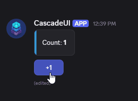

<p align="center">
  
</p>

A state management and UI framework for [discord.py](https://github.com/Rapptz/discord.py) bots. Views read from one store, changes flow through dispatched actions and reducers, and the UI rebuilds itself. The architecture that runs large web frontends, adapted to Discord's component system.

## A working view

Ownership, instance limits, and state-driven rebuilds, in twenty lines:

```python
import discord
from discord.ui import ActionRow
from cascadeui import StatefulButton, StatefulLayoutView, card

class Counter(StatefulLayoutView):
    owner_only = True       # only the opener can click
    instance_limit = 1      # one live counter per user

    count = 0

    async def on_load(self):
        self.build_ui()

    def build_ui(self):
        self.clear_items()
        self.add_item(card(f"Count: **{self.count}**"))
        self.add_item(ActionRow(StatefulButton(
            label="+1",
            style=discord.ButtonStyle.primary,
            callback=self.increment,
        )))

    async def increment(self, interaction):
        self.count += 1
        self.build_ui()
        await self.refresh()
```

```python
from discord.ext import commands

@bot.hybrid_command()
async def counter(ctx):
    await Counter(context=ctx).send()
```

<p align="center">
  
</p>

That is the whole thing. No manual `message.edit()`, no tracking who opened
what, no `interaction.response` branching. The next step is moving `count` out
of the view and into the store, which is where cross-view reactivity,
persistence, and undo come from.

## Why

Interactive Discord UIs get hard to manage as they grow. State accumulates
across `View` attributes, components stop responding after a restart, multi-step
forms lose data between pages, and sharing anything between views means manual
plumbing in every callback.

- **One source of truth.** Views read from a central store instead of their own
  attributes, so two views showing the same data cannot disagree.
- **One way to change it.** Dispatched actions and reducers, so a state change
  has a single path and a single place to read it.
- **Patterns instead of one-offs.** Menus, pagination, forms, wizards, tabs, and
  persistent panels are library primitives, not things you rebuild per project.
- **Interaction control by declaration.** Ownership, instance limits, participant
  caps, and navigation stacks are class attributes rather than checks you
  remember to write.
- **Persistence that survives restarts.** SQLite and PostgreSQL backends, opt-in
  per slot, with views that re-attach to their Discord messages after a restart.

## Start here

1. **[Install it](guide/installation.md)** and verify the import.
2. **[Build the counter above](guide/quickstart.md)**, then move its state into
   the store.
3. **[Add a pattern](guide/patterns.md)** -- pagination or a form is usually the
   second thing a real bot needs.

From there, [Core Concepts](guide/concepts.md) covers the mental model and
[Examples](examples.md) has eighteen runnable cogs, from a counter to a full
Battleship game.

## Data flow

Every UI change follows the same path:

```
User clicks button
       │
  Interaction dispatched
       │
  Callback runs → dispatch(action)
       │
  Middleware pipeline (logging, persistence, undo)
       │
  Reducer transforms state
       │
  Subscribers notified (filtered by action + selector)
       │
  on_state_changed() → refresh() → UI updated
```

## When it earns its keep

Even a single panel benefits from `owner_only = True` and `instance_limit = 1`.
The same framework scales to shared state across views, real persistence,
multi-step flows with validation, navigation stacks, and grid-based game boards.

## Requirements

- Python 3.10+
- discord.py 2.7+

## Support

- [Discord Server](https://discord.com/invite/9Xj68BpKRb) -- help, discussion, and updates
- [GitHub Issues](https://github.com/HollowTheSilver/CascadeUI/issues) -- bug reports and feature requests
